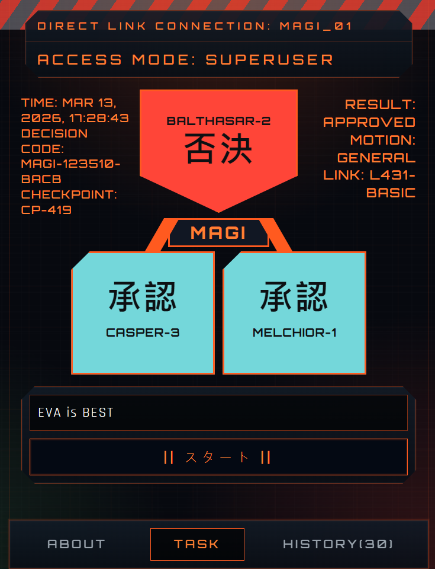

# MAGI EVA Tribute UI

Mobile-first MAGI-inspired decision console tribute.  
For personal, non-commercial fan sharing only.

## UI Preview



## Run with Docker Compose (Primary)

Build and start:

```bash
docker compose up -d --build
```

Open `http://localhost:8080`.

Stop:

```bash
docker compose down
```

Logs:

```bash
docker compose logs -f
```

## Local Dev (Optional)

```bash
npm install
npm run dev
```

Open `http://localhost:5173`.

## Validate

```bash
npm run lint
npm test
npm run build
```

## Structure

```text
src/
  app/            # tabs and page UI
  components/     # shared visual components
  lib/            # classify, simulation, audio
  styles/         # global styles
public/sounds/    # mp3 assets
ops/nginx/        # nginx runtime config
docker-compose.yml
Dockerfile
docs/images/      # README preview assets
```

## Decision Model (Majority Rule)

- `MELCHIOR-1`: logic/system integrity
- `BALTHASAR-2`: ethics/protection
- `CASPER-3`: instinct/self-preservation

Final result uses majority voting:

- `APPROVED` when at least 2 of 3 nodes vote `APPROVE`
- `REJECTED` when at least 2 of 3 nodes vote `DISSENT`

## Public Domain (VPS)

1. Prepare a VPS with Docker + Docker Compose.
2. Deploy this repo and run `docker compose up -d --build`.
3. Point DNS `A` record to VPS IP.
4. Put TLS reverse proxy in front (Nginx Proxy Manager / Caddy / Traefik).
5. Enable HTTPS certificate (Let's Encrypt).

## Audio Sources

- Urgent simple tone loop (processing)
- Electric fence alert (rejected)
- Game success alert (approved)

Source: https://mixkit.co/free-sound-effects/alerts/  
License: https://mixkit.co/license/
